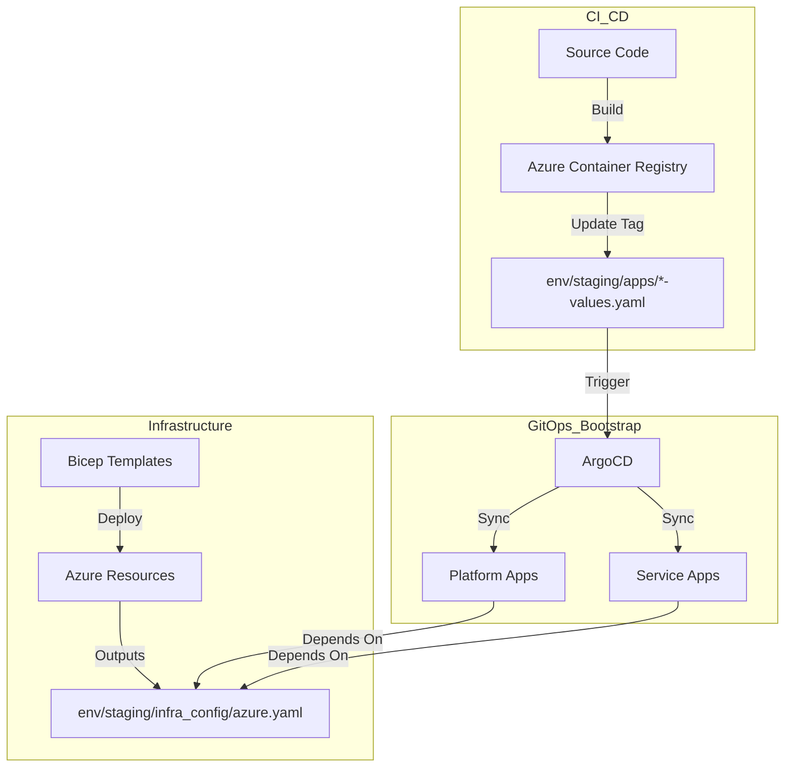

# Shared Deployment Strategy

This document outlines the release workflow, infrastructure architecture, and GitOps strategy for the monorepo. It serves as the authoritative reference for how code moves from development to production.

## Architecture Overview

The deployment uses a **layered GitOps approach** with clear separation of concerns:

### Key Components
- **Infrastructure as Code (Bicep)**: Single entry point `infra/bicep/main.bicep` orchestrates AKS, ACR, Cosmos DB, Storage, and Networking.
- **Configuration Bridge**: `env/{env}/infra_config/azure.yaml` acts as the interface between Infra (Bicep) and App (Helm), containing dynamic values like ACR names, OIDC issuers, and workload identities.
- **GitOps (ArgoCD)**: "App-of-apps" pattern with two roots:
  - `platform-root.yaml`: Shared services (Istio Gateway, cert-manager).
  - `app-root.yaml`: Business applications (toy, trip, web).

## Environments

| Environment | Purpose | Source Branch | Config Location | Promotion |
| --- | --- | --- | --- | --- |
| **staging** | Integration, demo, dev | `main` | `env/staging/` | Automatic on merge to main |
| **production** | Public demo, stable | `release/*` or tag | `env/production/` | Manual PR (copy values from staging) |

## CI/CD Pipelines

### 1. Infrastructure Deployment (`deploy-infra.yml`)
**Trigger**: Push to `infra/bicep/**` or manual dispatch.
**Flow**:
1. **Deploy Bicep**: Provisions/updates Azure resources.
2. **Generate Config**: Extracts outputs to `env/staging/infra_config/azure.yaml`.
3. **Inject Identities**: Updates `azure.yaml` and service `*-values.yaml` with new Workload Identity Client IDs.
4. **Bootstrap ArgoCD**: Installs ArgoCD on AKS and applies root applications.
5. **Commit Changes**: Pushes updated config back to the repo.

### 2. Service Build & Deploy (`build-*.yml`)
**Trigger**: Push to `src/services/{service}/**`.
**Flow**:
1. **Read Config**: Loads ACR name and login server from `azure.yaml`.
2. **Build & Push**: Builds Docker image, tags with `sha` and `latest`, pushes to ACR.
3. **Update Config**: Updates `image.tag` in `env/staging/apps/{service}-values.yaml`.
4. **Commit**: Pushes change to repo, triggering ArgoCD sync.
5. **Race Handling**: Includes retry logic for concurrent commits.

## Infrastructure Components

- **AKS Automatic**: Managed Kubernetes with Azure CNI Overlay, Cilium, and Workload Identity.
- **Networking**: Zone-redundant NAT Gateway, private endpoints for data services.
- **Data**: Cosmos DB (Serverless SQL API), Storage Accounts (Zone-redundant).
- **Identity**: OIDC Federation links Kubernetes Service Accounts to Azure Managed Identities.

## Release Patterns

- **Rolling Updates**: Standard Kubernetes deployment strategy via ArgoCD.
- **Rollback**: Revert the commit in `env/{env}/apps/` or use `git revert`. ArgoCD will sync the previous image tag.
- **Secret Management**: No secrets in repo. Uses Workload Identity for Azure access and sealed secrets (if needed) for others.

## Operational Procedures

### Promoting to Production
1. Verify staging is healthy.
2. Create a PR copying `env/staging/apps/{service}-values.yaml` content to `env/production/apps/{service}-values.yaml`.
3. Merge PR -> ArgoCD syncs production.

### Troubleshooting
- **ArgoCD Sync Failed**: Check `kubectl get app -n argocd`.
- **Pod Identity Issues**: Verify `azure.workload.identity/client-id` annotation matches `azure.yaml`.
- **Build Failed**: Check GitHub Actions logs; ensure `azure.yaml` exists and is valid.

